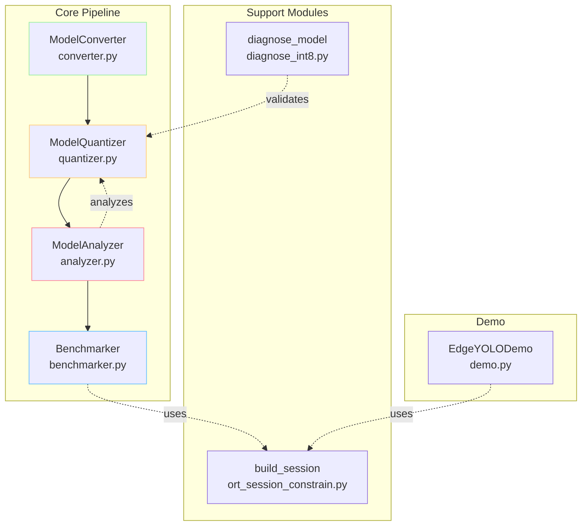

# 🔬 ONNX INT8 Paradox: An Experimental Analysis

[](https://www.python.org/)
[](https://onnx.ai/)
[](LICENSE)
[](https://www.apple.com/mac/)

## 📌 TL;DR

**What happens when INT8 quantization goes wrong?** This project reveals a 37x performance degradation with INT8 quantization on Apple M3, challenging conventional optimization wisdom and demonstrating why hardware-aware optimization is crucial for edge AI deployment.

- ✅ **3.6x model size reduction** achieved (10.3MB → 2.9MB)
- ❌ **37x slower inference** with INT8 on M3 (4.12ms → 152ms)
- 🔍 **Root cause identified**: 63 DynamicQuantizeLinear operations without hardware acceleration

---

## 🎯 Why This Matters

Edge AI promises intelligent computing on resource-constrained devices. The standard playbook says: "*Quantize your model to INT8 for faster inference.*" 

**But what if that's wrong?**

This project systematically investigates model optimization techniques for edge deployment, uncovering a critical hardware dependency that can make or break your optimization strategy. Through comprehensive benchmarking of YOLOv5n on Apple M3, we demonstrate that **optimization without hardware awareness is optimization in the dark**.

## ⚡ Quick Start

```bash
# Clone and setup
git clone https://github.com/candleboxyz/exp--onnx_int8_paradox.git
cd exp--onnx_int8_paradox

# Initialize virtual environment (adjust with preferred package managing)
uv init

# Download YOLOv5n model
wget https://github.com/ultralytics/yolov5/releases/download/v7.0/yolov5nu.pt

# Run complete optimization pipeline
python main.py --model yolov5nu.pt --output results

# View results
cat results/report.md

# Optional: Run live demo
python main.py --model yolov5nu.pt --demo
```

## 📊 Key Results at a Glance

### Performance Under Different Scenarios

<table>
<tr>
<td>

**🔬 Controlled Benchmark** (Single-thread)
| Model | Latency | FPS | 
|-------|---------|-----|
| FP32  | 4.12ms  | 242.6 |
| INT8  | 152.02ms | 6.6 |
| **Degradation** | **37x slower** ⚠️ | |

</td>
<td>

**🌍 Practical Benchmark** (Auto-thread)
| Model | Latency | FPS |
|-------|---------|-----|
| FP32  | 5.65ms  | 177.1 |
| INT8  | 63.32ms | 15.8 |
| **Degradation** | **11x slower** ⚠️ | |

</td>
</tr>
</table>

### Model Size Optimization

```
Original PyTorch model:     5.3 MB
           ↓
ONNX FP32 model:          10.3 MB (includes graph metadata)
           ↓
ONNX INT8 model:           2.9 MB ✅ (3.6x compression)
```

## 🏗️ System Architecture

Modular design ensures reproducibility and extensibility:



## 🔬 Technical Deep Dive

### The Quantization Paradox

Industry documentation consistently reports INT8 benefits:
- **4x memory reduction** (theoretical maximum)
- **2-4x speedup** on appropriate hardware[^1][^2]

**Apple M3 measurements tell a different story:**
- ✅ 3.6x memory reduction (close to theoretical)
- ❌ 37x slowdown (catastrophic performance degradation)

#### Why Did INT8 Fail on Apple M3?

**The analysis revealed 63 DynamicQuantizeLinear operations** creating a critical bottleneck:

```
For each of 63 layers:
FP32 → [Compute Scale] → [Quantize] → INT8 → [Conv] → [Dequantize] → FP32
       ↑_________________overhead per operation_________________↑
```

**Root Cause Analysis:**
1. **M3 Neural Engine has INT8 support**[^3] but operates independently of the CPU[^3]
2. **ONNX Runtime's CPUExecutionProvider cannot access the Neural Engine**
3. **Without CPU INT8 acceleration**, each quantization operation adds overhead instead of optimization
4. **CoreMLExecutionProvider could potentially access Neural Engine** but requires model conversion

This creates a perfect storm: the quantization overhead (63 operations) far exceeds any theoretical benefit from reduced precision computation.

### Hardware Performance Comparison

| Platform | INT8 Performance | Source | Hardware Support |
|----------|-----------------|--------|------------------|
| **Apple M3 (CPU)** | **37x slower** ❌ | This work | Neural Engine has INT8[^3], CPU doesn't utilize it |
| **Qualcomm Snapdragon**\* | Up to 3x faster ✅ | Qualcomm[^4] | Hexagon DSP with HVX acceleration |
| **NVIDIA T4**\* | ~5x faster ✅ | NVIDIA[^5] | TensorRT with DP4A instructions |

\* *Vendor-reported performance; not independently verified in this project*

**Key Insight**: The dramatic performance difference demonstrates that INT8 optimization is not universal - it's entirely dependent on hardware support at the execution level.

### Controlled Variable Analysis

We tested identical models under two scenarios to isolate the impact of threading:

| Configuration | FP32 Performance | INT8 Performance | Analysis |
|--------------|------------------|------------------|----------|
| Single-thread (controlled) | Optimal (4.12ms) | Catastrophic (152ms) | INT8 operations serialize |
| Multi-thread (practical) | Degraded (5.65ms) | Improved (63.32ms) | Parallelization helps INT8 |

**Key Insight**: FP32 operations are so optimized on M3 that multi-threading adds overhead. INT8 operations desperately need parallelization to be remotely viable.

## 📈 Comprehensive Performance Metrics

### Statistical Analysis

| Metric | FP32 (Single) | INT8 (Single) | FP32 (Multi) | INT8 (Multi) |
|--------|---------------|---------------|--------------|--------------|
| Mean (ms) | 4.12 | 152.02 | 5.65 | 63.32 |
| Std Dev (ms) | 0.44 | 10.95 | 0.69 | 4.24 |
| CV | 0.108 | 0.072 | 0.122 | 0.067 |
| P95 (ms) | 4.81 | 170.23 | 6.93 | 70.89 |
| IQR (ms) | 0.52 | 15.23 | 0.89 | 5.67 |

**Observation**: INT8 shows lower CV (coefficient of variation) - not because it's stable, but because the bottleneck is consistent!

## 🛠️ Implementation Details

### Core Modules

- **`converter.py`**: PyTorch → ONNX conversion with validation
- **`quantizer.py`**: Dynamic INT8 quantization implementation
- **`benchmarker.py`**: Multi-scenario performance evaluation
- **`analyzer.py`**: Model structure and operation analysis
- **`ort_session_constrain.py`**: Centralized session management for reproducibility

### Design Patterns

1. **Abstract Base Class**: `ModelOptimizer` provides template for optimization strategies
2. **Factory Function**: `build_session()` centralizes ONNX Runtime configuration for consistency
3. **Strategy Pattern**: Multiple benchmarking scenarios (controlled vs practical) with unified interface

## 🎓 Lessons Learned

### 1. Hardware Awareness is Non-negotiable

The testing revealed catastrophic INT8 performance on Apple M3 CPU, contrasting sharply with vendor-reported speedups on other platforms:

| Platform | INT8 vs FP32 | Why the Difference? |
|----------|--------------|---------------------|
| **Apple M3 Test** *(this)* | 37x slower ❌ | No CPU INT8 acceleration |
| **Qualcomm Claims**[^4] | Up to 3x faster ✅ | Dedicated Hexagon DSP |
| **NVIDIA Reports**[^5] | ~5x faster ✅ | Hardware DP4A instructions |

This stark contrast proves that **optimization strategies must be validated on target hardware**.

### 2. Benchmarking Methodology Matters

Single-configuration benchmarks hide critical performance characteristics:
- **Thread scheduling impact**: 58% performance difference between single vs multi-thread for INT8
- **Parallelization requirements**: INT8 operations desperately need parallelization to be remotely viable
- **Hidden bottlenecks**: Only comprehensive profiling revealed 63 quantization operations

### 3. Size ≠ Speed

We achieved 3.6x size reduction but suffered 37x speed degradation. For edge deployment:
- **Size matters** for storage/transmission
- **Speed matters** for user experience  
- **Different models needed** for different constraints

## 🚧 Limitations & Future Work

### Current Limitations

1. **Single Platform Testing**: Results specific to Apple M3 Max; other hardware based on vendor documentation
2. **Limited Model Coverage**: Only tested YOLOv5n; different architectures may show different patterns
3. **Dynamic Quantization Only**: Static quantization with calibration unexplored
4. **No Direct NPU Testing**: Comparison with actual NPU devices pending

### Future Directions

- [ ] Test on actual NPU hardware (Qualcomm Snapdragon, MediaTek Dimensity)
- [ ] Implement static quantization with calibration dataset
- [ ] Compare with platform-specific tools (TensorRT, Core ML, SNPE)
- [ ] Explore structured pruning and knowledge distillation
- [ ] Develop hardware-aware optimization selector
- [ ] Benchmark on edge devices (Raspberry Pi, Jetson Nano, Coral Dev Board)

## 💡 Key Takeaways for Practitioners

1. **Always benchmark on your target hardware** 
   - Expected: 3-4x INT8 speedup (based on literature)
   - Reality: 37x slowdown on M3 CPU
   - Lesson: Never assume optimization benefits transfer across platforms

2. **Understand the execution path**
   - M3 has INT8 support in Neural Engine ✅
   - ONNX Runtime uses CPU execution ❌
   - Result: Hardware capability ≠ Software accessibility

3. **Profile before optimizing**
   - 63 DynamicQuantizeLinear operations discovered only through profiling
   - Each adds overhead without hardware acceleration
   - Bottleneck location matters more than optimization technique

4. **Consider the full deployment context**
   - Size reduction: Success (3.6x) ✅
   - Speed improvement: Failure (37x slower) ❌
   - Decision: Choose optimization based on actual constraints

5. **Document negative results**
   - Failed optimizations are valuable learning experiences
   - Help others avoid the same pitfalls
   - Contribute to collective understanding

## 🤝 Industry Implications

This project demonstrates critical challenges in edge AI deployment:

### The Hardware-Software Gap

- **Generic optimizations fail**: The 37x slowdown proves that "one-size-fits-all" optimization doesn't work
- **NPU compilers are crucial**: Specialized compilation tools must bridge the model-hardware gap
- **Co-design is essential**: Hardware and software must evolve together

### Why This Matters

The measured **37x penalty on M3 CPU** versus **3-5x acceleration on NPU-equipped devices**[^4][^5] validates that:
1. Edge AI requires specialized hardware acceleration
2. Software optimization alone is insufficient
3. Compiler technology must be hardware-aware

This research underscores why the industry is investing heavily in:
- Custom AI accelerators (NPUs, TPUs)
- Hardware-aware compilation frameworks
- Model-hardware co-optimization tools

---

## 📄 License

This project is licensed under the MIT License - see the [LICENSE](LICENSE) file for details.

---

*"In edge AI, the difference between success and failure often lies not in the model, but in understanding the hardware it runs on. What works on one platform may fail catastrophically on another."*

<!-- ## 📚 References -->

<!-- ### Core Research -->
[^1]: Jacob, B., et al. (2018). "Quantization and Training of Neural Networks for Efficient Integer-Arithmetic-Only Inference." CVPR. https://arxiv.org/abs/1712.05877

[^2]: Krishnamoorthi, R. (2018). "Quantizing Deep Convolutional Networks for Efficient Inference." https://arxiv.org/abs/1806.08342

[^3]: "Apple vs. Oranges: Evaluating the Apple Silicon M-Series SoCs for HPC Performance and Efficiency" arXiv:2502.05317v1 (2025). Shows Neural Engine supports INT8/FP16 but operates independently of CPU.

<!-- ### Vendor Performance Data -->
[^4]: Qualcomm AI Hub Documentation. "Quantized models can have up to a 3x improvement in performance." https://app.aihub.qualcomm.com/docs/hub/quantize_examples.html (Accessed 2025)

[^5]: "Fast INT8 Inference for Autonomous Vehicles with TensorRT 3." NVIDIA Developer Blog. Reports ~5x speedup on Pascal GPUs. https://developer.nvidia.com/blog/int8-inference-autonomous-vehicles-tensorrt/

<!-- ### Implementation References -->
[^6]: ONNX Runtime Documentation. "Execution Providers." https://onnxruntime.ai/docs/execution-providers/

[^7]: Apple Inc. (2023). "Apple unveils M3, M3 Pro, and M3 Max." Details 18 TOPS Neural Engine performance. https://www.apple.com/newsroom/2023/10/apple-unveils-m3-m3-pro-and-m3-max-the-most-advanced-chips-for-a-personal-computer/

[^8]: Ultralytics. (2023). YOLOv5 Documentation. https://docs.ultralytics.com/yolov5/

[^9]: ONNX Runtime Team. (2023). "Graph Optimizations in ONNX Runtime." https://onnxruntime.ai/docs/performance/model-optimizations/graph-optimizations.html

[^10]: Nagel, M., et al. (2021). "A White Paper on Neural Network Quantization." https://arxiv.org/abs/2106.08295

[^11]: ONNX Contributors. (2023). ONNX Protocol Buffers Definition. https://github.com/onnx/onnx/blob/main/onnx/onnx.proto

[^12]: Apple Inc. (2023). Accelerate Framework Documentation. https://developer.apple.com/documentation/accelerate/bnns

[^13]: Wu, H., et al. (2020). "Integer Quantization for Deep Learning Inference: Principles and Empirical Evaluation." https://arxiv.org/abs/2004.09602

[^14]: ONNX Community. (2023). ONNX: Open Neural Network Exchange. https://onnx.ai/about.html

[^15]: Han, S., et al. (2016). "Deep Compression: Compressing Deep Neural Networks with Pruning, Trained Quantization and Huffman Coding." ICLR. https://arxiv.org/abs/1510.00149

[^16]: Banner, R., et al. (2019). "Post Training 4-bit Quantization of Convolutional Networks for Rapid-deployment." NeurIPS. https://arxiv.org/abs/1810.05723
